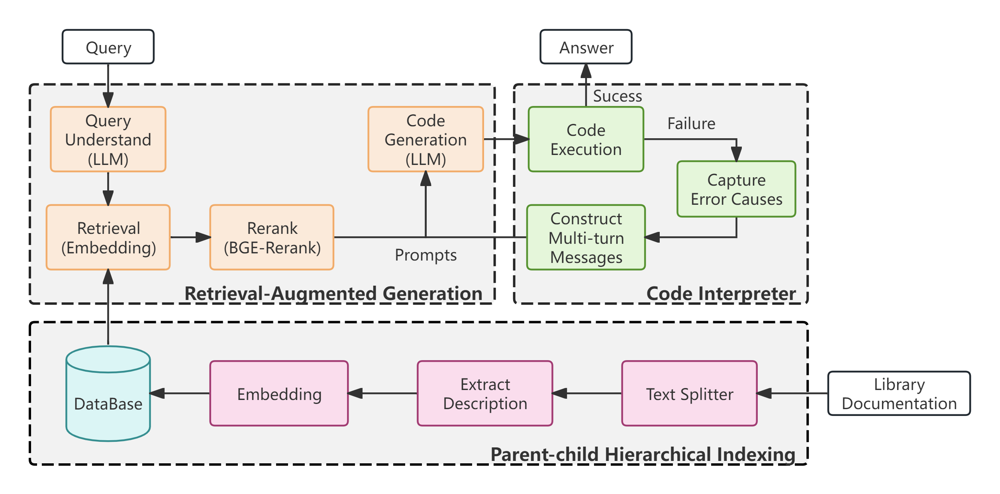

# Code-Interpreter

**SMP 2024 大模型图分析挑战赛 - 初赛第三名**

## 环境要求

请在以下环境下运行项目，确保安装的包版本与要求一致，以避免潜在的兼容性问题：

- `python==3.10.14`
- `cython==3.0.10`
- `cmake==3.29.2`
- `demon==2.0.6`
- `graspologic==3.3.0`
- `karateclub==1.2.3`
- `leidenalg==0.10.2`
- `llama_index==0.10.58`
- `matplotlib==3.8.4`
- `networkx==3.3`
- `numpy==1.26.4`
- `openai==1.26.0`
- `python-igraph==0.11.5`
- `pyaml_env==1.2.1`
- `littleballoffur==2.1.12`
- `faiss-cpu==1.8.0`

## 项目结构

```plaintext
code_interpreter
├── common.py          # 通用工具函数及常量定义
├── data               # 存放测试集题目需求文件
├── database           # 原始数据文件目录
├── embedding.py       # 嵌入向量生成，使用 openai text-embedding-3-small 模型
├── faiss_client.py    # faiss 向量库客户端，负责向量数据库构建与检索功能
├── index              # 预处理数据与向量库索引文件存放目录
├── llm.py             # LLM 客户端，处理核心任务，解答图分析问题
├── main.py            # 读取题目 JSON 文件，生成并提交解答
├── main_.py           # main.py 的多线程版本，提升并发解答能力
├── outputs            # 程序输出结果文件存放目录
├── prompts            # 提示词文件目录
├── readme.md          # 项目概述与使用说明
├── requirements.txt   # Python 依赖包列表
├── rerank.py          # 实现二阶段检索后的重排序功能
├── setting.py         # 项目配置文件，包括 API Key 和 Prompt 字典
└── submit             # 提交的 JSON 结果文件存放目录
```

## 核心功能模块说明



### 1. 向量数据库构建

构建向量数据库索引采用的方案为父子层级索引，项目中的所有数据均基于主办方提供的原始数据集。向量库的构建流程包括数据预处理与向量化处理，详细实现位于 `faiss_client.py`。

#### 索引构建

针对 `network.json` 等原始文件，每个函数的说明字典被提取为一条记录。通过使用 `\n` 等分隔符，将字典数据转化为适合搜索的文本格式，形成 parent chunks，对每个parent chunk 提取 `Description` 字段作为child chunk，每个child chunk 都有一个其所对应的 parent index。query 检索时，在 child chunks 中进行检索，后依据被检索到的child chunks 所对应的 parent index 回至父段块（目的是为了获得更完整的上下文），以父段作为最终的增强信息获得答案。

#### 向量化说明

使用 `openai text-embedding-3-small` 模型将每条数据向量化，生成用于检索的向量表，并使用 `faiss` 构建向量数据库索引。

### 2. 二阶段检索

项目中使用了二阶段检索器来提升检索效率与精度，具体实现位于 `faiss_client.py`。

#### 阶段 1：问题改写

首先，通过设计特定的提示词（位于 `prompts/prompt.json`），调用大模型（LLM）将问题进行改写，使其更适合检索。

#### 阶段 2：文档召回

将改写后的问题文本向量化（使用 `text-embedding-3-small` 模型），并通过 `faiss` 向量数据库进行检索，召回最相关的 `rate * top_k` 个文档。

#### 重排序

召回后的文档进行重排序，通过 `bge-reranker-v2-m3` 模型对这些文档重新排序，并选取前 `top_k` 个文档作为最终的背景知识。

### 3. 题目解答模块

题目解答流程的实现逻辑位于 `llm.py`。系统根据二阶段检索召回的文档，结合设定的提示词，组织成 `messages`，并调用 LLM 生成代码来解决问题。

#### 解答流程

1. **生成代码**：调用大模型接口生成解题代码，并通过正则表达式提取出可执行的代码部分。
2. **执行代码**：调用代码执行模块，运行生成的代码，并获取运行结果。
3. **错误处理**：如代码执行失败，捕获错误信息，反馈至模型，再次生成修正后的代码。
4. **循环优化**：上述流程会重复 `n` 次（参数可调）。如果经过 `n` 次循环仍无法生成正确解答，则直接调用模型输出结果。

## 使用注意事项

1. **模型使用说明**：由于资金限制，比赛复赛阶段使用的是 `gpt-4o-mini` 模型，而非性能更优的 `gpt-4o` 模型。
2. **API Key 配置**：请在 `setting.py` 文件中设置 OpenAI 的 API Key。
3. **运行程序生成提交结果**：请根据 `requirements.txt` 安装依赖环境，运行以下命令生成提交文件：
   ```bash
   python main.py
   ```
